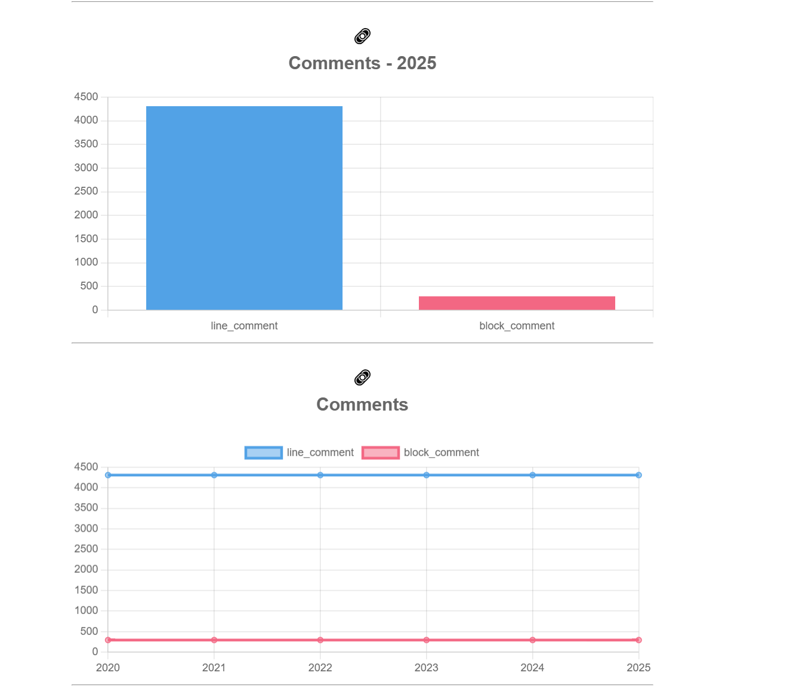

# Explorando evolução de código

Neste exercício, iremos explorar a evolução de código em sistemas reais.

Iremos utilizar a ferramenta [GitEvo](https://github.com/andrehora/gitevo).
Essa ferramenta analisa a evolução de código em repositórios Git nas linguagens Python, JavaScript, TypeScript e Java, e gera relatórios `HTML` como [este](https://andrehora.github.io/gitevo-examples/python/pandas.html).

Mais exemplos de relatórios podem ser podem ser encontrados em https://github.com/andrehora/gitevo-examples.

# Passo 1: Selecionar repositório a ser analisado

Selecione um repositório relevante na linguagem de sua preferência (Python, JavaScript, TypeScript ou Java).
Você pode encontrar projetos interessantes nos links abaixo:

- Python: https://github.com/topics/python?l=python
- JavaScript: https://github.com/topics/javascript?l=javascript
- TypeScript: https://github.com/topics/typescript?l=typescript
- Java: https://github.com/topics/java?l=java

# Passo 2: Instalar e rodar a ferramenta GitEvo

> [!NOTE]
> Antes de instalar a ferramenta, é recomendado criar e ativar um [ambiente virtual Python](https://packaging.python.org/en/latest/guides/installing-using-pip-and-virtual-environments/#create-and-use-virtual-environments).

Instale a ferramenta [GitEvo](https://github.com/andrehora/gitevo) com o comando:

```
$ pip install gitevo
```

Execute a ferramenta no repositório selecionado utilizando o comando abaixo (ajuste conforme a linguagem do repositório).
Substitua `<git_url>` pela URL do repositório que será analisado:

```shell
# Python
$ gitevo -r python <git_url>

# JavaScript
$ gitevo -r javascript <git_url>

# TypeScript
$ gitevo -r typescript <git_url>

# Java
$ gitevo -r java <git_url>
```

Por exemplo, para analisar o projeto Flask escrito em Python:

```
$ gitevo -r python https://github.com/pallets/flask
```

> [!NOTE]
> Essa etapa pode demorar alguns minutos pois o projeto será clonado e analisado localmente.

# Passo 3: Explorar o relatório de evolução de código

Após executar a ferramenta [GitEvo](https://github.com/andrehora/gitevo), é gerado um relatório `HTML` contendo diversos gráficos sobre a evolução do código.

Abra o relatório `HTML` e observe com atenção os gráficos.

# Passo 4: Explicar um gráfico de evolução de código

Selecione um dos gráficos de evolução e explique-o com suas palavras.
Por exemplo, você pode:

- Detalhar a evolução ao longo do tempo
- Detalhar se as curvas estão de acordo com boas práticas
- Explicar grandes alterações nas curvas
- Explorar a documentação do repositório em busca de explicações para grandes alterações
- etc.

Seja criativo!

# Instruções para o exercício

1. Crie um `fork` deste repositório (mais informações sobre forks [aqui](https://docs.github.com/pt/pull-requests/collaborating-with-pull-requests/working-with-forks/fork-a-repo)).
2. Adicione o relatório `HTML` no seu fork.
3. No Moodle, submeta apenas a URL do seu `fork`.

Responda às questões abaixo diretamente neste arquivo `README.md` do seu fork:

1. Repositório selecionado: <https://github.com/kdn251/interviews>
2. Gráfico selecionado: <>
3. Explicação:<

O gráfico mostra a quantidade de comentários de linha e comentários de bloco no código, de 2020 até 2025.

Comentários de linha foram 4.307, estáveis em todos os anos e comentários de bloco 294, também constantes.Ou seja, o projeto não teve variação nesse aspecto durante os últimos 5 anos.

Boas práticas observadas

A quantidade de comentários em relação às linhas de código sugere que há documentação interna suficiente, mas não exagerada. Aproximadamente 1 comentário a cada 5 linhas de código. Manter a mesma quantidade ao longo do tempo pode indicar que o projeto está estável, sem grandes refatorações que alterem a estrutura do código.

Pontos de atenção que foram observadas

Ausência de evolução: é curioso que o número de comentários nunca mudou em 5 anos. Isso pode indicar que o projeto está congelado ou com poucas alterações, ou o processo de documentação não acompanhou possíveis evoluções. Além disso, pode indicar que existem comentários de bloco escassos: apenas 294 em todo o código. Sugerondo que a o desenvolvedor prefere comentários curtos e diretos.

Hipóteses em relação ao resultado:

O repositório pode ter passado por um grande congelamento de features desde 2020, considerando que o relatório gerado pelo GitEvo captura apenas a última versão de cada arquivo por ano; se não houve mudanças estruturais, os valores permanecem idênticos.


